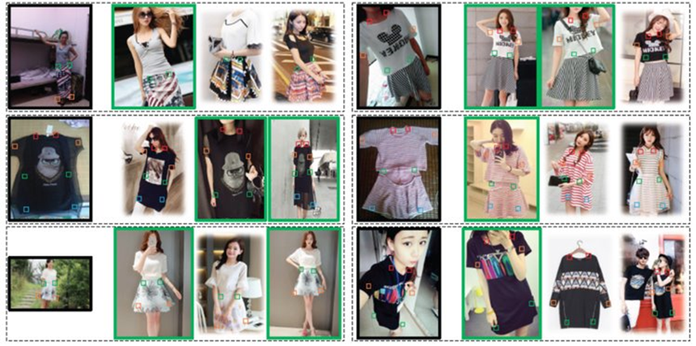

# AI for fashion - Final project (2021/2022): Consumer 2 shop analysis

  

## Project idea

The consumer-to-shop task, is a known and hard-to-solve task in the context of Artificial Intelligence for fashion [1];

It consist in recognizing the exact fashion item wear by a person in an everyday context, retrieving pictures of people wearing it in a professional setting (models for e-commerce site, fashion shows...).

Solving this task, would impact in the fashion field from a several perspectives (e.g., e-commerce, marketing analysis, design).

Despite the growing interest on this topic [2,3,4,5], there is a lot of work to do to achieve high enough performances;

We are not here to solve one of the most difficult Computer Vision problems in the field of fashion, but to provide a little contribution analyzing how well-known deep learning models (CNNs), available on Orange, are good to catch visual similarities in such a context;

## Project goals

- (a) Create a small consumer-to-shop dataset, considering pictures depicting you wearing some cloth items and pictures (downloaded from professional e-commerce) of professional models wearing the same item!
- (b) Analyzing those group of images with Orange, firstly extracting features adopting one of the available CNNs and using them to carry out a Hierarchical clustring, as unsupervised machine learning techniques;
- (c) Finally, create a presentation in which you describe the obtained results and pose the basis for a qualitative analysis that could explain the visual similarities found by the adopted deep learning model.

## Students projects
| Student  | Project Folder |
| ------------- | ------------- |
| Name surname | |

## References

- [1] Liu, Z., Luo, P., Qiu, S., Wang, X., & Tang, X. (2016). Deepfashion: Powering robust clothes recognition and retrieval with rich annotations. In Proceedings of the IEEE conference on computer vision and pattern recognition (pp. 1096-1104).

- [2] Hadi Kiapour, M., Han, X., Lazebnik, S., Berg, A. C., & Berg, T. L. (2015). Where to buy it: Matching street clothing photos in online shops. In Proceedings of the IEEE international conference on computer vision (pp. 3343-3351).

- [3] Ji, X., Wang, W., Zhang, M., & Yang, Y. (2017, October). Cross-domain image retrieval with attention modeling. In Proceedings of the 25th ACM international conference on Multimedia (pp. 1654-1662).

- [4] Gajic, B., & Baldrich, R. (2018). Cross-domain fashion image retrieval. In Proceedings of the IEEE Conference on Computer Vision and Pattern Recognition Workshops (pp. 1869-1871).

- [5] Chopra, A., Sinha, A., Gupta, H., Sarkar, M., Ayush, K., & Krishnamurthy, B. (2019). Powering robust fashion retrieval with information rich feature embeddings. In Proceedings of the IEEE/CVF Conference on Computer Vision and Pattern Recognition Workshops (pp. 0-0).
