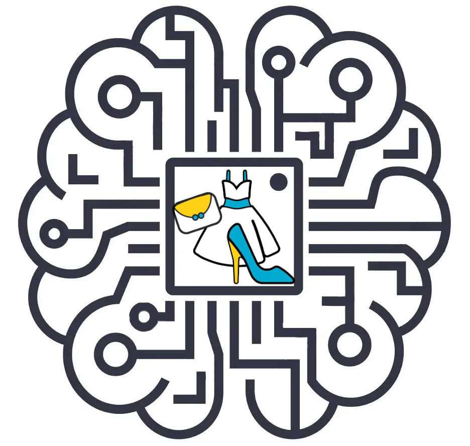

# AI-For-Fashion

  

## Course Program

| Data  | Argomento | Docente | Slide| Google Colab lezione |
| ------------- | ------------- | ------------- |-----------------------------------------------------------------------------------------------------------------| ------------- |
| 14/03/2022  | Introduction | [Lorenzo Stacchio](https://www.unibo.it/sitoweb/lorenzo.stacchio2) | [00_intro.pdf](00_course_intro/00_intro.pdf)                                                   | Not present |
| 15/03/2022  | Ai for fashion | [Lorenzo Stacchio](https://www.unibo.it/sitoweb/lorenzo.stacchio2) | [01_AI_fashion](01_AI_fashion/01_intro_ai_fashion.pdf)                                                   | Not present |
| 21/03/2021  | Python programming & data analysis tools | [Lorenzo Stacchio](https://www.unibo.it/sitoweb/lorenzo.stacchio2) | [xxx](xxx)|  |
| 22/03/2022  | Orange introduction | [Lorenzo Stacchio](https://www.unibo.it/sitoweb/lorenzo.stacchio2) | [xxx](xxx)                                                   | Not present |
| 28/03/2022  | Data Visualization | [Alessia Angeli](https://www.unibo.it/sitoweb/alessia.angeli2) | [xxx](xxx)                                                   | Not present |
